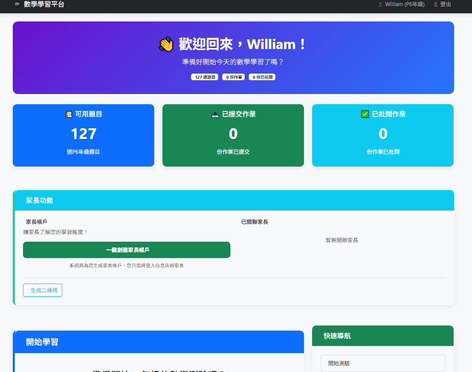

# KnowingCraft – AI-Assisted Mathematics Learning Platform (MVP)

**Live Demo:**
https://www.knowingcraft.com

An AI-assisted mathematics learning platform that helps students practice more effectively through interactive quizzes, AI-powered tutoring, and personalized learning tools.

KnowingCraft is a personal product that I designed and developed from the ground up, covering product planning, backend architecture, database design, AI integration, and full-stack implementation.

The platform is currently used in real teaching environments and continues to evolve through iterative development.

---

---

## Why I Built KnowingCraft

After more than 15 years of teaching mathematics, I noticed that many students struggled for different reasons, yet most learning materials treated every student the same.

KnowingCraft was created to explore how AI can support more personalized learning by combining educational experience with practical software engineering.

Rather than building a demonstration project, my goal was to build a working product that could be continuously improved based on real user feedback.

---

## Current Features (MVP)

* Student account system
* Mathematics question bank
* Randomized practice by grade and topic
* AI-assisted tutoring and explanations
* Personal vocabulary collections (Chinese & English)
* Learning dashboard
* Progress tracking

---

## In Development

* AI-powered weakness analysis
* Personalized practice recommendations
* Parent portal
* Enhanced learning analytics

---

## Technology Stack

* Python
* Flask
* SQLAlchemy
* SQLite / MySQL
* Google Gemini API
* HTML
* CSS
* Bootstrap

---

## Technical Highlights

### AI Integration

Integrated Google Gemini to provide AI-assisted tutoring and learning support within the platform.

### Full-Stack Development

Designed and implemented the complete application, including backend architecture, database models, business logic, authentication, and user interface.

### Database Design

Designed relational database structures for users, question banks, learning records, and AI interactions.

### Product Development

Managed the project from concept to deployment, continuously improving features based on practical teaching experience and user feedback.

---

## Project Status

KnowingCraft is an actively developed MVP. New features are continuously added as the platform evolves toward a production-ready AI learning SaaS.

---

## Core Technologies

Python • Flask • SQLAlchemy • Google Gemini API • SQLite • HTML • CSS • Bootstrap
